# AI Reinforced Concrete Beam Design System (AI-RCBDS)

An intelligent web-based structural engineering application that automates the complete analysis and design of reinforced concrete beam elements in accordance with **BS 8110** using **Artificial Intelligence (Random Forest Regression)** and **Natural Language Processing (NLP)**.

The system enables structural engineers, educators, and students to describe complex beam design requirements in plain English, automatically extracts engineering parameters, predicts suitable beam dimensions using machine learning, performs complete BS 8110 structural design calculations, generates reinforcement detailing recommendations, renders interactive loading/SFD/BMD diagrams, and exports professional calculation sheets in PDF format.

This software system was designed and developed by **Engr. Micheal T. Shokunbi** (**MEEK Technology**) for **Adesemoye David, Abdulrasheed Nurudeen, Abdulazeez Waliy, and Abbas Jamiu** as a Final Year Research Project in the Department of Civil Engineering, **Federal University Oye-Ekiti (FUOYE)**, in partial fulfilment of the requirements for the award of the degree of **Bachelor of Engineering (B.Eng.) in Civil Engineering**.

---

## 🛠 Built With


<p align="left">
  
</p>


---

## 🌟 Core Features & Structural Capabilities

- **Natural Language Multi-Load Prompt Interface**: Express complex structural inputs naturally (e.g., *"3-span continuous beam spans 5m 6m 5m, span AB UDL 20kN/m, span BC UDL 15kN/m and point load 30kN at 2m, span CD point load 25kN at 3m"*).
- **Heterogeneous Multi-Load Engineering Engine**: Full support for single-span and multi-span continuous systems carrying combinations of:
  - Uniformly Distributed Loads (UDLs) over full spans
  - Partial UDLs with specific start/end locations or global coordinate ranges (`from X to Y m`)
  - Multiple Concentrated Point Loads (`p1`, `p2`, `p3`...) at arbitrary locations or span midpoints
  - Self-weight and factored wall line loads (density $\times$ thickness $\times$ height)
- **Comprehensive BS 8110 Structural Analysis**:
  - Superposition principle calculations for moment ($M_{udl} + \sum M_{point}$) and shear ($V_{udl} + \sum V_{point}$)
  - Three-Moment Theorem matrix solver ($[A]\{M\} = \{b\}$) for statically indeterminate continuous beams ($2$ to $5$ spans)
  - Flexural reinforcement design ($K, z, A_{s,req}, A_{s,min}, A_{s,provided}$)
  - Shear stress compliance & link reinforcement design ($v, v_c, v_{max}, A_{sv}/s_v$)
  - Deflection checks ($L/d$ basic and allowable limits per BS 8110 Table 3.9)
  - Automatic iterative beam resizing when initial section dimensions fail deflection or shear criteria
- **Supported Beam Configuration Types**:
  1. **Simply Supported Beams** (Pinned - Roller)
  2. **Cantilever Beams** (Fixed - Free End)
  3. **Overhanging Beams** (Interior span with cantilever extension)
  4. **Multi-Span Continuous Beams** (2 to 5 spans with flexible support boundary conditions)
- **Interactive Visualizations**:
  - Dynamic HTML5 Canvas structural loading diagrams with standard engineering support symbols
  - High-resolution Chart.js plots for Shear Force Diagrams (SFD) and Bending Moment Diagrams (BMD) with peak annotations
- **Professional Engineering Documentation**:
  - **BS 8110 Calculation Sheet PDF**: Complete step-by-step mathematical breakdown with formulas, design moments, steel areas, link selection, reinforcement schedules, and deflection checks.
  - **Design Results Summary Report PDF**: Executive structural summary report for project documentation.

---

## 🔄 System Workflow

```
Engineering Prompt
        │
        ▼
Natural Language Processing (Regex Pattern Extraction)
        │
        ▼
Parameter Extraction & Parsing
        │
        ▼
Confirm Parsed Parameters (Interactive Modal)
        │
        ▼
Random Forest Machine Learning Prediction (Steel Area & Dimensions)
        │
        ▼
BS 8110 Structural Design Engine (Superposition & Three-Moment Solver)
        │
        ▼
Flexural & Shear Reinforcement Detailing
        │
        ▼
Interactive HTML5 Beam Loading Diagram
        │
        ▼
Load Profile Distribution Diagram
        │
        ▼
Shear Force Diagram (SFD)
        │
        ▼
Bending Moment Diagram (BMD)
        │
        ▼
Export BS 8110 PDF Calculation Sheet
```

---

## 💻 Tech Stack & Component Classification

### Artificial Intelligence & Machine Learning
- **Random Forest Regression**: Predicts required reinforcement steel area ($A_s$) and cross-section parameters based on 5,000+ BS 8110 compliant beam designs.
- **Natural Language Processing (NLP)**: Regex-based deterministic parser for multi-span and multi-load natural language prompts.
- **Scikit-Learn**: Machine learning model training, hyperparameter tuning, and serialization.
- **NumPy & Pandas**: Matrix solver calculations, vector operations, data preprocessing, and dataset management.

### Backend Architecture
- **Python 3.12+**: Core programming engine.
- **FastAPI**: Asynchronous high-performance REST API.
- **Uvicorn**: ASGI web server implementation.

### Frontend Interface
- **HTML5 & Vanilla CSS3**: Cyberpunk Industrial Dark & Glassmorphic modern aesthetic.
- **Vanilla JavaScript (ES6+)**: Dynamic modal dialogs, AJAX requests, DOM manipulation.
- **Chart.js 4.4**: Animated high-resolution plotting for Load, SFD, and BMD curves.

### Structural Engineering Core
- **BS 8110 Design Code**: British Standard structural concrete design rules.
- **Three-Moment Theorem Solver**: Indeterminate matrix solver for continuous beams.

### Report Generation Suite
- **ReportLab 4.x**: Server-side programmatic PDF generation with custom headers, multi-section tables, and reinforcement schedules.
- **Pillow (PIL)**: High-DPI canvas image compositing for embedded report diagrams.

---

## 📸 System Screenshots

### 1. Home Interface & Landing Overlay
<p align="center">
  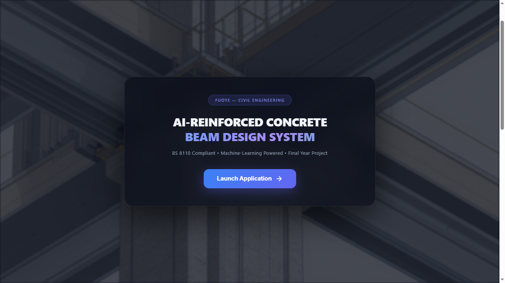
</p>

---

### 2. Natural Language Prompt Input
<p align="center">
  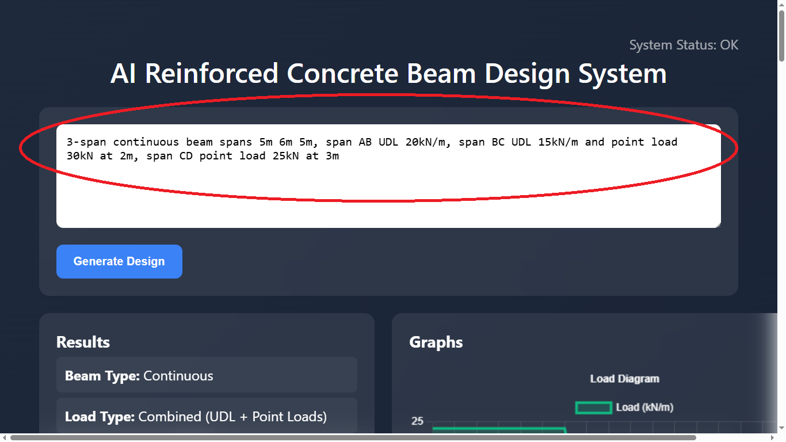
</p>

---

### 3. Parameter Confirmation Modal
<p align="center">
  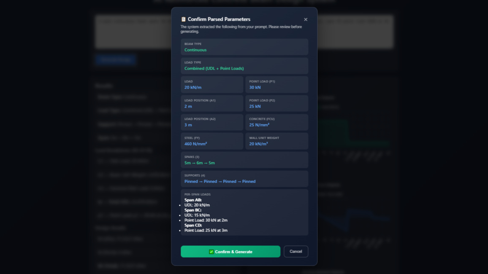
</p>

---

### 4. Comprehensive Design Results
<p align="center">
  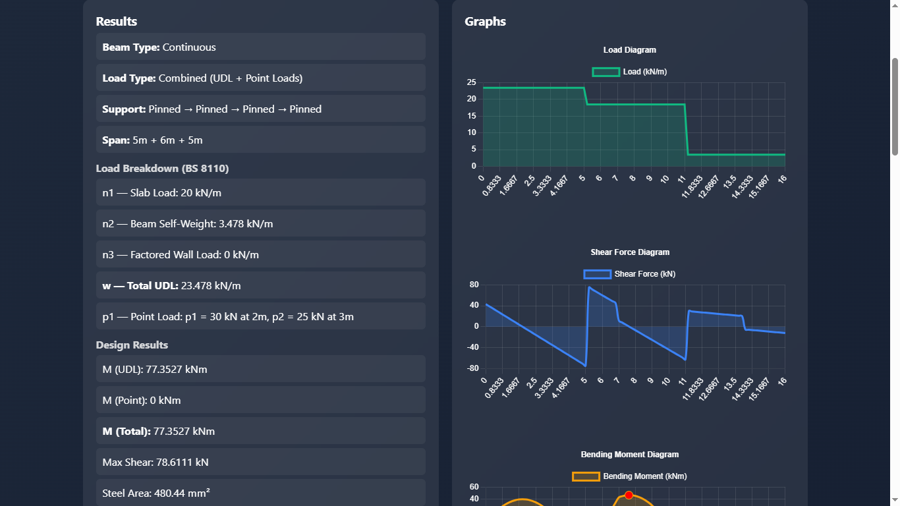
</p>

<p align="center">
  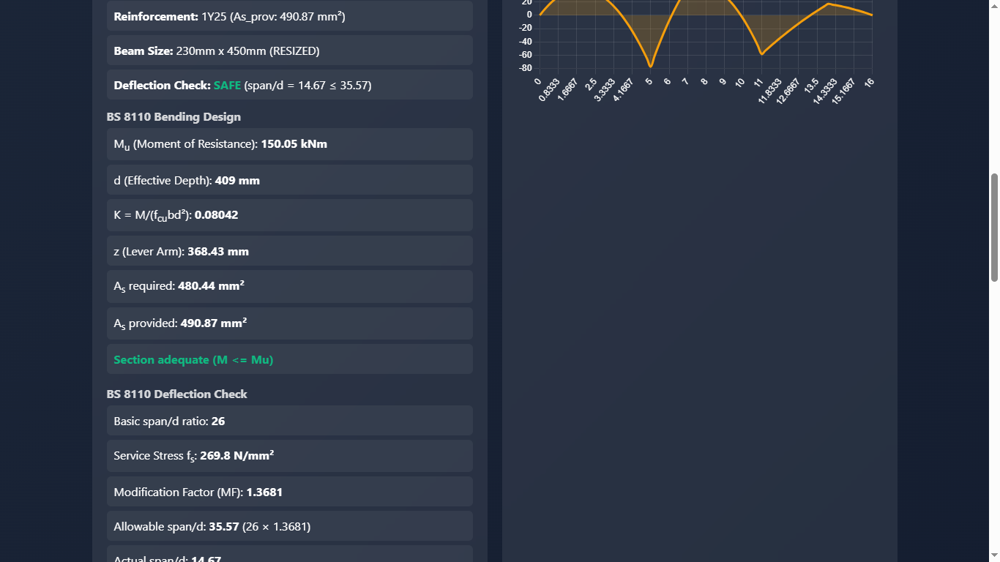
</p>

<p align="center">
  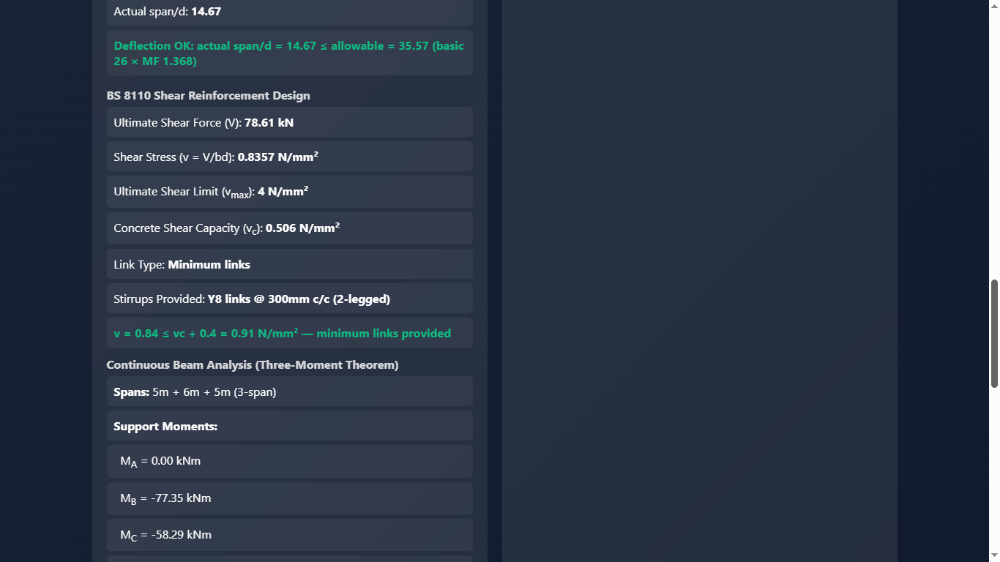
</p>

<p align="center">
  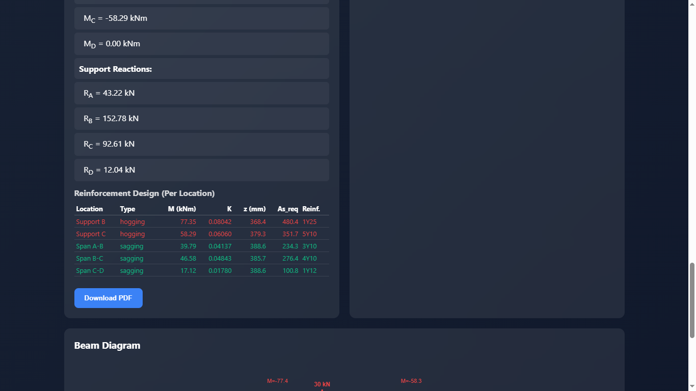
</p>

---

### 5. Interactive HTML5 Beam Diagram
<p align="center">
  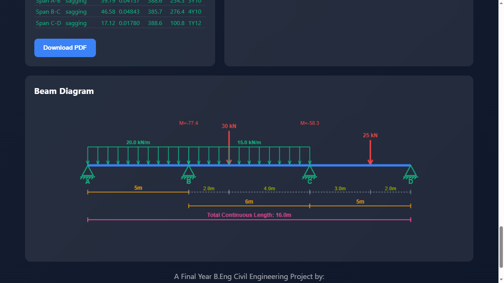
</p>

---

### 6. Load Distribution Diagram
<p align="center">
  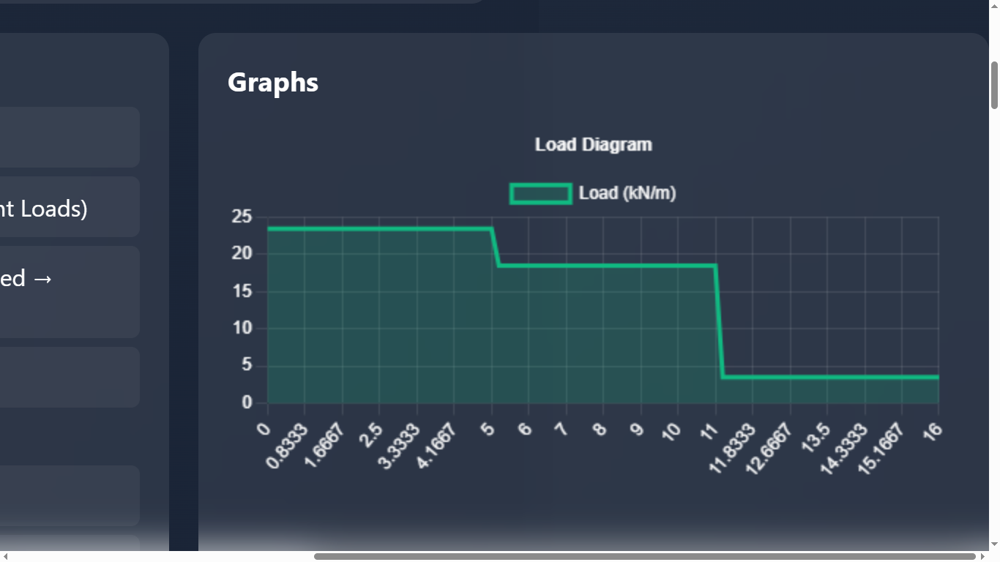
</p>

---

### 7. Shear Force Diagram (SFD)
<p align="center">
  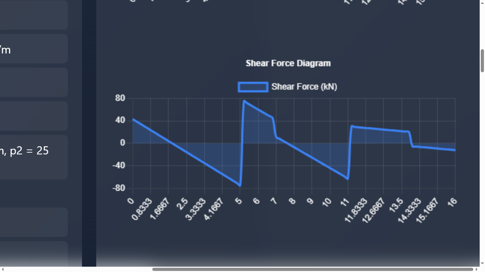
</p>

---

### 8. Bending Moment Diagram (BMD)
<p align="center">
  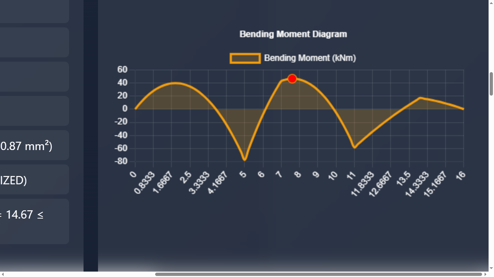
</p>

---

### 9. Download Option Modal
<p align="center">
  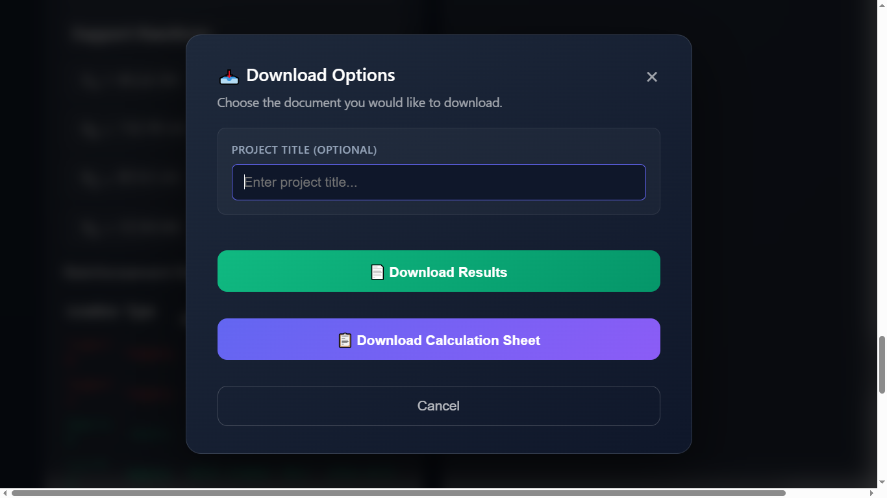
</p>

---

### 10. Generated BS 8110 PDF Calculation Sheet
<p align="center">
  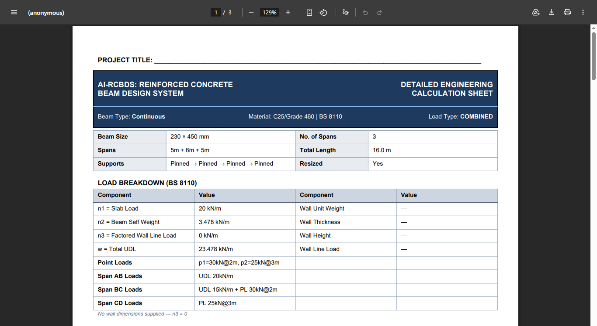
</p>
<p align="center">
  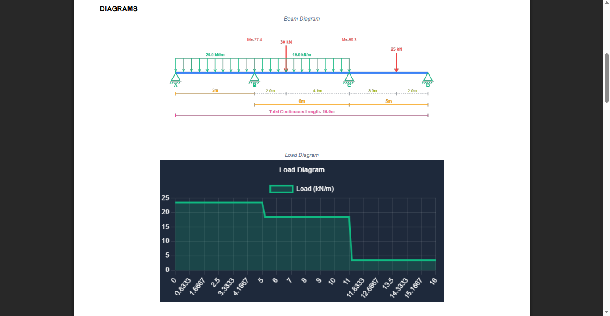
</p>
<p align="center">
  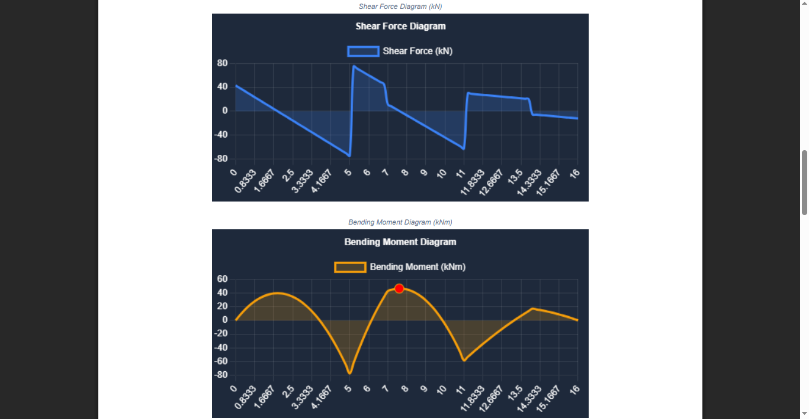
</p>
<p align="center">
  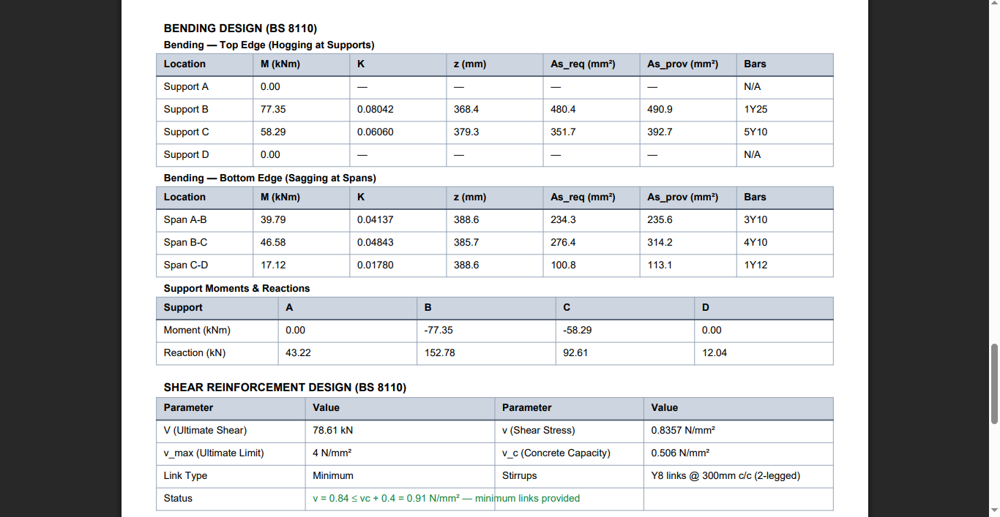
</p>
<p align="center">
  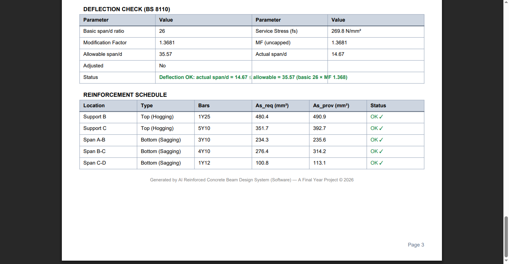
</p>

---

## 🚀 Installation & Running Locally

1. **Clone the Repository**:
   ```bash
   git clone https://github.com/Meek-Technology/ai-rcbds.git
   cd ai-rcbds
   ```

2. **Set Up Virtual Environment**:
   ```bash
   python -m venv venv
   .\venv\Scripts\activate  # Windows (PowerShell)
   source venv/bin/activate # Linux/macOS
   ```

3. **Install Dependencies**:
   ```bash
   pip install -r requirement.txt
   ```

4. **Launch the Application**:
   ```bash
   uvicorn api.main:app --host 127.0.0.1 --port 8000 --reload
   ```

5. **Access Web Application**: Open `http://127.0.0.1:8000` in your web browser.

---

## 📁 Repository Directory Structure

```text
AI-RCBDS/
│
├── api/                        # FastAPI REST Web Application & Static Assets
│   ├── static/                 # HTML5, CSS3, JavaScript (script.js, index.html)
│   ├── calc_sheet.py           # BS 8110 Calculation Sheet PDF Generator
│   ├── main.py                 # Primary REST API endpoints (/parse, /predict, /download)
│   └── report.py               # Summary PDF Report Generator
│
├── nlp/                        # Natural Language Processing Engine
│   └── prompt_parser.py        # Regex parameter extractor & load map compiler
│
├── rules/                      # BS 8110 Structural Engineering Calculation Solvers
│   ├── beam_design.py          # Flexure, Shear, Deflection & Superposition Solvers
│   └── continuous_beam.py      # Three-Moment Theorem Matrix Solver
│
├── data/                       # Dataset Generation & CSV Datasets
│   ├── generate_data.py        # Synthetic dataset generator
│   └── beam_dataset.csv        # 10,000+ trained beam design samples
│
├── model/                      # Machine Learning Training & Model Storage
│   ├── train_model.py          # Random Forest training script
│   └── model.pkl               # Serialized Random Forest model artifact
│
├── documentation/              # Academic & Engineering Technical Documentation
│   ├── chapter1.md ... chapter5.md
│   └── manual_testing_doc.md   # CLI PowerShell Testing Protocol
│
├── parameter_guide.md          # Comprehensive Prompting Syntax & Parameter Guide
├── manual_testing_doc.md       # Manual PowerShell CLI Testing Documentation
├── requirement.txt             # Python Package Dependencies
└── README.md                   # Project System README
```

---

## 📝 Example Prompts for Testing

### 1. Simply Supported Beam (UDL + Point Load)
`Design a simply supported beam with span 6m, UDL 20kN/m and point load 30kN at 2m, fcu 30, fy 500`

### 2. Simply Supported Beam (Multiple Point Loads)
`Design a simply supported beam span 8m with point loads 25kN at 2m and 40kN at 6m`

### 3. Partial UDL + Point Load
`Simply supported beam 5m span, UDL 15kN/m from 0 to 3m and point load 20kN at 4m`

### 4. Overhang Beam (UDL + Free End Point Load)
`Overhang beam span 6m overhang 2m, UDL 15kN/m on span and point load 10kN at free end`

### 5. Overhang Beam (Multiple Point Loads)
`Overhang beam 5m span, 1.5m overhang, point loads 20kN at 3m and 15kN at 6.5m`

### 6. Continuous Beam (3 Spans with Heterogeneous Loading & Fixed Ends)
`Analyze the continuous beam ABCD. Support A and D are fixed, while B and C are roller supports. Span AB = 12 m, BC = 12 m, and CD = 4 m. A UDL 20 kN/m from 12m to 24m, while a 250 kN point load acts at the midpoint of span CD.`

### 7. Continuous Beam (2 Spans with Midpoint Load & Range UDL)
`Analyze the continuous beam ABC. Support A is fixed, while B and C are roller supports. Span AB is 3 m and span BC is 8 m. A UDL 2 kN/m from 0 to 3m, while a 10 kN point load acts at the midpoint of BC.`

### 8. Cantilever Beam
`Cantilever beam 3m, UDL 10kN/m and point load 15kN at 3m`

---

## 🔬 Research Contribution & Engineering Value

This project demonstrates the practical application of Artificial Intelligence in Structural Engineering through:
- **ML-Assisted Beam Sizing**: Machine learning predictions trained on code-compliant structural outputs.
- **Natural Language Structural Interaction**: Eliminating tedious manual data entry forms via regex NLP parsing.
- **Automated BS 8110 Compliance**: Real-time evaluation of ULS bending/shear and SLS deflection limits.
- **Intelligent Reinforcement Detailing**: Algorithmic selection of optimal bar combinations to minimize steel waste.
- **Automated Engineering Documentation**: Instant generation of audit-ready PDF calculation sheets.

---

## 🔮 Future Improvements & Roadmap

- **Multi-Member Expansion**: Column design, Slab design, and Pad Foundation modules.
- **International Building Codes**: Support for **Eurocode 2 (BS EN 1992)** and **ACI 318**.
- **BIM & CAD Integration**: Direct export to DXF reinforcement drawings and IFC building models.
- **Cloud Deployment**: Containerized Docker deployment on cloud infrastructure (AWS / GCP).

---

## 👤 Author & Attribution

### 💻 Lead Software & AI Systems Engineer
**Engr. Micheal T. Shokunbi**  
*Computer Engineer | Software Engineer | AI Researcher*  
**MEEK Technology**

### 🏗 Civil Engineering Research Team (FUOYE)
- **Adesemoye David**
- **Abdulrasheed Nurudeen**
- **Abdulazeez Waliy**
- **Abbas Jamiu**

### 🏛 Academic Institution
**Department of Civil Engineering**,  
Faculty of Engineering,  
**Federal University Oye-Ekiti (FUOYE)**, Nigeria.  
*In partial fulfilment of the requirements for the award of the degree of Bachelor of Engineering (B.Eng.) in Civil Engineering.*

---